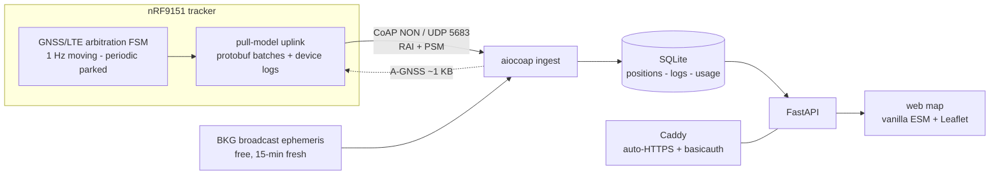

# nrf9151-tracker

A GPS tracker that rides at 1 Hz and fits in a 10 MB/month IoT plan:
nRF9151 firmware (Zephyr/[NCS](https://github.com/nrfconnect/sdk-nrf)), a small
Python server, and a no-build web map — one repo, everything field-measured.

- boot → registered **6 s** · assisted indoor cold-boot fix **~17 s**
- **~6 B per GPS point** on the wire · **~1 KB/min** riding
- parked: 120 s periodic GNSS checks, backing off to 30 min without sky
- the full sim → server → web loop runs with **zero hardware**

Measured on the reference deployment (NB-IoT B20, Vodafone UK roaming, flolive
SIM, one small VM); the stack is network- and host-agnostic. Full spec sheet:
`git show v0.1.0-alpha`.

## Architecture



## Try it — no hardware

```sh
curl -fsSL https://raw.githubusercontent.com/chgpalmer/nrf9151-tracker/main/setup.sh | bash
cd nrf9151-tracker-ws/nrf9151-tracker
make setup-host                # server deps
make demo                      # sim device -> local CoAP server -> web map on :8080
make setup-webtest && make webtest   # drive the UI headlessly, fail on any JS error
./smoke.sh                     # build + demo end-to-end, incl. the A-GNSS exchange
```

The `native_sim` build swaps one file (a modem mock) for the real modem — the
firmware under test is otherwise the shipping firmware.

## Hardware

Requires: an [nRF9151-DK](https://www.nordicsemi.com/Products/Development-hardware/nRF9151-DK),
any LTE-M/NB-IoT SIM, Ubuntu 24.04 (WSL2 fine — Python 3.13+ breaks NCS module
pins), and a host with a public UDP port for the server.

```sh
cp env.template .env           # server host/port, SIM APN — see Configuration
make setup-tools               # nrfutil, usbip, tio
make build                     # APP=tracker BOARD=nrf9151dk/nrf9151/ns
make windows-usb-passthrough   # WSL only: attach the J-Link (usbipd)
make flash
make uart
```

## Configuration (`.env`)

Host-specific values are never committed. `cp env.template .env`, then:

| Variable | Used by | Purpose |
|---|---|---|
| `TRACKER_SERVER_HOST/PORT` | `make build` | CoAP server the device sends to (`coap://HOST:PORT/obs`, UDP) |
| `TRACKER_APN` | `make build` | SIM-provider APN; empty = the SIM's default |
| `CADDY_DOMAIN` | `make serve` | domain for auto-HTTPS; empty = plain HTTP by IP |
| `CADDY_USERNAME/PASSWORD` | `make serve` | web-UI basicauth |
| `OPENCELLID_TOKEN` | `make update-cells` | tower DB for locating cell-only fixes |

Precedence: CLI > `.env` > default (`make build TRACKER_SERVER_HOST=x` wins).

## How it works

**GNSS/LTE arbitration.** One radio, two tenants. An explicit FSM decides who
owns it: 1 Hz continuous GNSS while moving, modem-native periodic fixes while
parked, LTE deactivated outright when idle-mode paging chops GNSS windows.
[`docs/loc-fsm-decision-table.md`](docs/loc-fsm-decision-table.md) is the
NORMATIVE description — code, table, and `make fsmtest` change together, and
every threshold in it traces to a measured incident.

**Assisted GNSS.** The server pulls the free BKG broadcast-ephemeris file,
does all ICD-200 scaling server-side, and answers the device's CoAP request
with ~1 KB of ephemerides elevation-filtered at its last known position.

**Wire protocol.** Protobuf in non-confirmable CoAP POSTs over UDP. Schema in
one place (`proto/tracker.proto` + nanopb options); both codecs are generated
(`make proto`), so ends can't drift. GPS data travels as track segments — one
absolute anchor plus packed zigzag delta arrays, per-point time implicit —
so a moving point costs ~6 B instead of ~33 B. Speed is per-point GNSS
Doppler, never derived (position-delta speed carries ~8 km/h jitter at 1 Hz).
Segments cap at 50 points pre-encode to stay under the ~512 B cellular-safe
MTU; a batch is several datagrams, `RAI_ONGOING` on intermediates and
`RAI_LAST` on the final one so the modem drops the radio connection
immediately instead of waiting out the network's inactivity timer.

**Uplink.** Pull model: sources (cell fixes, GPS segments, device logs)
register with priorities; the drain loop fills datagrams through
transactional encode/commit/rollback cursors — a failed send loses nothing,
and the ring buffers ~34 min of 1 Hz offline. Device logs (INF and up) ship
over the same path; WRN+ triggers an urgent flush. Every datagram lands in a
`usage` ledger, and the same cost model runs in the browser as the settings
estimator.

**Data budget.** ~1 KB/min riding, a few hundred B/h parked. Carrier-billed
bytes run ≈ 2× the app-layer arithmetic (per-session rounding — measured, so
budget with the factor). The ingest is anonymous and unauthenticated; DTLS-PSK
via the modem's offloaded sockets is the planned upgrade.

## Verification

| Tier | Command | Contract |
|---|---|---|
| FSM unit | `make fsmtest` | 52 ztest cases pin the decision table |
| Server | `make servertest` | pytest against a committed real broadcast-ephemeris file |
| Web UI | `make webtest` | Playwright, desktop 1400×900 + phone 360×740, structural asserts |
| End-to-end | `./smoke.sh` | build + sim → server → web, incl. A-GNSS exchange |

## Deployment

```sh
make setup-host                          # python deps only
make serve                               # public HTTP by IP
make serve CADDY_DOMAIN=tracker.example.com  # auto-HTTPS via Let's Encrypt
```

The API binds `127.0.0.1`; Caddy (systemd, survives Ctrl-C) is the only public
face, with bcrypt basicauth from `.env`. First run opens the firewall
(80/443 TCP, 5683 UDP) — cloud security lists must allow the same.

## Status

`v0.1.0-alpha` — first coherent end-to-end state; the tag annotation is the
spec sheet. Open: DTLS-PSK for the ingest, registration-loss vs GNSS (F-5),
indoor churn (F-6), wake-fix corroboration, quiet-while-parked, LTE-M carrier
scan, NTN.

## Reference

**Make targets:** `setup-zephyr` (venv + west + SDK), `setup-tools`,
`windows-usb-passthrough`, `build`, `flash`, `recover`, `uart`, `gdb`,
`clean`, `sim`, `proto`, `fsmtest`, `demo`, `serve`, `webtest`,
`servertest`, `update-cells`. Variables: `APP`
(`tracker`|`gnss`|`hello`|`atprobe` — the last is a bare AT console for
modem diagnostics like carrier scans),
`BOARD` (`nrf9151dk/nrf9151/ns` — non-secure, required for modem/GNSS),
`PORT`, `BAUD`, `RUNNER`.

**LEDs:**

| LED | Meaning | Off | Blink | Solid |
|---|---|---|---|---|
| 1 | LTE | radio off on purpose | attaching | registered |
| 2 | GPS | GNSS not running | acquiring | fix current |
| 3 | TX | — | — | pulse per successful send |
| 4 | help | normal | CELL_LOOP (retry on sight) | GNSS_EXCLUSIVE (radio dark) |

LED2 solid = safe to start moving; LED4 lit explains a dark LED1.

**Layout:**

```
nrf9151-tracker-ws/          workspace root (created by setup.sh)
  zephyr/  nrf/  ...         SDK trees (west update, trimmed allowlist)
  nrf9151-tracker/           this repo == the west manifest
    west.yml                 imports sdk-nrf v3.4.0 (name-allowlist)
    proto/tracker.proto      wire schema — single source for both codecs
    mk/fw.mk  mk/server.mk   firmware / server make targets
    apps/tracker/            the firmware (gnss/, hello/ = bring-up; atprobe/ = AT console)
    server/                  aiocoap ingest + FastAPI + static webapp
    docs/loc-fsm-decision-table.md   normative FSM spec
    tests/fsm/               ztest suite for loc_fsm + motion
    scripts/                 setup, webtest, seeding, usbipd passthrough
```
